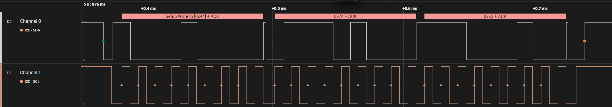

<p align="center">
    
    
     
</p>

# ch32-pt2259

Бібліотека для управління аудіопроцесором PT2259 (6-канальний регулятор гучності) для мікроконтролерів CH32. Підтримує як апаратний (Hardware), так і програмний (Software) I2C.

### Сумісність
- Платформа: CH32V00X / CH32V20X
- Залежності: [ch32-time](https://github.com/yevheniisukhominskiy/ch32-time), [ch32-soft-i2c](https://github.com/yevheniisukhominskiy/ch32-soft-i2c) (для софт режиму)

### Зміст
- [Основні можливості](#features)
- [Приклад використання](#example)
- [Функції](#functions)
- [Встановлення](#install)
- [Ліцензія](#license)

## <a name="features"></a>Основні можливості
- Регулювання гучності від 0 до -79дБ.
- Функція Mute.
- Вибір між апаратним I2C та софт-ногодригом.
- Робота з окремими каналами або всіма одночасно.

## <a name="example"></a>Приклад (Софт I2C)
```c
#include "debug.h"
#include "time.h"
#include "soft_i2c.h"
#include "pt2259.h"

SoftI2_t i2c1 = {
    .sda_port = GPIOC, .sda_pin = GPIO_Pin_7,
    .scl_port = GPIOC, .scl_pin = GPIO_Pin_5
};

PT2259_t pt1 = {.i2c = &i2c1};

int main(void) {
    SystemCoreClockUpdate();
    systick_init();
    softi2c_init(&i2c1);

    pt2259_clear(&pt1);
    pt2259_setvolume_both(&pt1, false, 25); // 25% гучності
    
    while(1) {
        // ваш код
    }
}
```

### Результат роботи


## <a name="configuration"></a>Перемикання I2C (Hardware/Software)
Для перемикання режиму роботи бібліотеки потрібно змінити значення макросу `SOFT_I2C_ON` у файлі [pt2259.h](file:///c:/Users/Eugene/mounriver-studio-projects/ch32-pt2259/lib/pt2259.h):

```c
// lib/pt2259.h
#define SOFT_I2C_ON  1 // 1 - Програмний I2C, 0 - Апаратний I2C
```

*   **SOFT_I2C_ON = 1**: Дозволяє використовувати будь-які GPIO піни за допомогою бібліотеки `soft_i2c`.
*   **SOFT_I2C_ON = 0**: Використовує вбудований апаратний модуль I2C контролера.

## <a name="functions"></a>Основні функції
- `pt2259_clear(PT2259_t* pt)` — повне скидання налаштувань чипа.
- `pt2259_setvolume(PT2259_t* pt, bool channel, uint8_t vol)` — встановлення гучності для лівого/правого каналу.
- `pt2259_setvolume_both(PT2259_t* pt, bool mute, uint8_t vol)` — гучність для обох каналів.
- `pt2259_mute(PT2259_t* pt, bool state)` — увімкнення/вимкнення звуку.

## <a name="install"></a>Встановлення
1. Скопіюйте вміст `lib` у ваш проект.
2. Підключіть `pt2259.h`.
3. Оберіть тип I2C у `pt2259.h` (Hardware/Software).

## <a name="license"></a>Ліцензія
MIT
